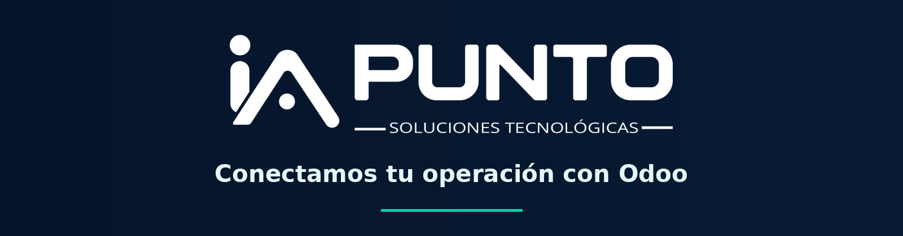

  

  
  
  
  

  
  
  
  
  

## Somos IA Punto

Ayudamos a las empresas a conectar sus operaciones con **Odoo**. Diseñamos soluciones para procesos reales de ventas, inventario, manufactura, proyectos y servicio, desde la implementación y personalización hasta las integraciones y el soporte.

Trabajamos desde Bucaramanga, Colombia, con un enfoque práctico: entender el proceso, construir lo necesario y acompañar su evolución.

## Qué hacemos

| Área | Nuestro trabajo |
| --- | --- |
| **Implementación de Odoo** | Configuración y adaptación a los procesos de cada empresa. |
| **Desarrollo** | Módulos y funcionalidades para necesidades específicas. |
| **Integraciones** | Conexión de Odoo con otros sistemas y fuentes de datos. |
| **Automatización** | Flujos que reducen tareas manuales y mejoran la trazabilidad. |
| **Soporte e infraestructura** | Acompañamiento técnico, despliegue y operación de soluciones empresariales. |

## Proyectos públicos

- [**Sitio web de IA Punto**](https://github.com/iapunto/web-astro): código del sitio web.
- [**bank-csv**](https://github.com/iapunto/bank-csv): extracción de movimientos bancarios desde PDF hacia CSV.

Algunos desarrollos para clientes se mantienen privados por confidencialidad.

## Conversemos

🌐 [iapunto.com](https://iapunto.com) · ✉️ [hola@iapunto.com](mailto:hola@iapunto.com)

[Facebook](https://www.facebook.com/iapunto/) · [Instagram](https://www.instagram.com/iapunto) · [LinkedIn](https://linkedin.com/company/iapunto) · [YouTube](https://www.youtube.com/@iapunto) · [X](https://x.com/iapunto)
